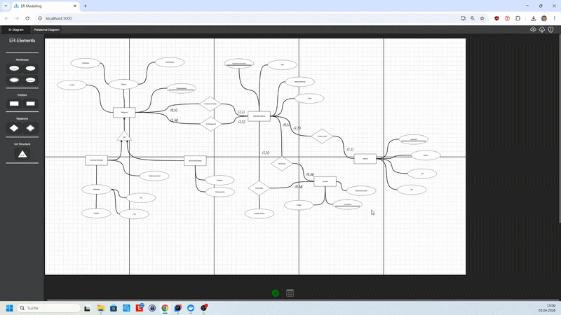

# Database Modelling Tool

A web application for modelling **Entity-Relationship diagrams**, transforming them into a **relational model**, and generating **SQL schema code** from the resulting database structure.

This project was originally developed as part of a project thesis at **Aalen University** and is designed to support users throughout essential steps of the relational database design process.

---

## Attention

Due to pricing reasons the site moved from heroku to azure.
The url is no longer https://dbmodelling.herokuapp.com but https://db-modelling-frontend-bqarc9d0ajekbug9.germanywestcentral-01.azurewebsites.net/

--- 

## Overview

Designing relational databases usually involves several manual and repetitive steps:

1. Modelling the conceptual structure as an **ER diagram**
2. Translating it into a **relational model**
3. Writing the corresponding **SQL schema**

This project aims to simplify that workflow by combining all three steps into one application.

The tool allows users to create ER diagrams in a graphical editor, validates the model proactively during modelling, translates valid ER structures into a relational model, and generates SQL code based on the generated schema.

---

## Features

- **Graphical ER diagram editor**
- **Proactive validation and user feedback**
- **Transformation from ER model to relational model**
- **SQL generator** based on the generated relational model
- **Upload / download support** for saved models
- **Web-based UI** for easy access and usage

---

## Validation Concept

A key aspect of this project is that the editor does not just validate the model afterwards — it was designed to support the user **during modelling**.

The application uses a proactive validation concept to prevent actions that would necessarily lead to invalid ER structures, while still keeping the modelling process flexible and user-friendly. This was one of the central design goals of the project.

---

## Supported Workflow

### 1. Create an ER Diagram
Use the drawing tool to model entities, relationships, attributes, weak entities, and IsA structures.

### 2. Transform to a Relational Model
Once the model is valid, the application derives a relational representation automatically.

### 3. Generate SQL
After assigning data types in the relational model, the application generates SQL schema code for a PostgreSQL-like target system.

---

## Tech Stack

### Frontend
- **React**
- **Redux / Redux Toolkit**
- **Create React App**

### Backend
- **Java**
- **Spring Boot**
- **Maven**

The frontend manages both the ER model and the relational model through Redux-based state slices, while the backend contains the transformation and SQL generation logic.

---

## Screenshots

### ER Modelling View

Fast modelling workflow of the ER diagram:


### Relational Model View

Fast transformation / relational model workflow:




### SQL Generation View


---

## Project Structure

```text
.
├── backend/               # Spring Boot server application
├── frontend/reactapp/     # React frontend
├── docs/                  # Additional documentation / project report
└── ...
```

---

## Academic Context

This software was created as part of a university project at **Aalen University** in the field of computer science.

The project focuses on supporting the design process of relational databases by combining:

- conceptual modelling with ER diagrams
- automated translation into a relational model
- SQL schema generation

A more detailed German-language explanation can be found in the project report inside the `docs` directory / accompanying documentation.

---

## Limitations

- The application was **not optimized for mobile devices**
- Development and testing were primarily done using **Google Chrome**
- The project is based on a specifically defined ER model with explicit modelling rules

---

## Future Work

Possible future improvements include:

- support for additional database modelling paradigms
- broader educational use as a learning platform
- extension of the supported modelling concepts
- modernization of deployment and toolchain

These ideas are also consistent with the outlook described in the project report.

---

## Author

Developed by Simon Ruttmann
Aalen University

---

## Documentation

For a full academic description of the concept, architecture, validation model, and transformation logic, see the project report:

- `docs/`
- project thesis / report included with this repository
